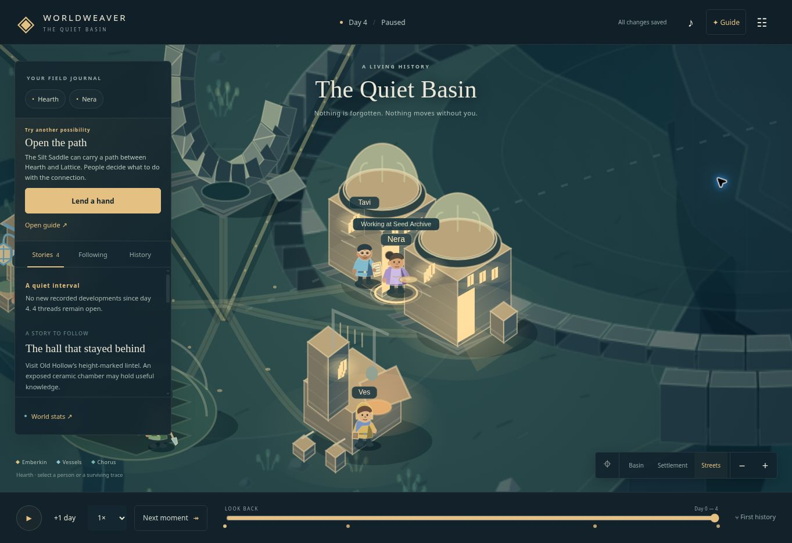

# Worldweaver — The Quiet Basin

[**Play the browser preview**](https://philipreese.github.io/WorldWeaver/) · [Phone testing](docs/MOBILE_TESTING.md)

A finite, explorable science-fiction world whose people make their own choices and leave a history you can inspect. Browser-first, statically served, no accounts, services, runtime AI, or paid dependencies.

**The preview now combines its authored opening with reusable household, migration, and settlement rules. The required Tier 2 release remains incomplete: general personal and institutional situations, persistent deprivation, and device/playtesting work remain.** See [implementation status](docs/IMPLEMENTATION_STATUS.md) and [verification](docs/VERIFICATION.md). The [v0.4 brief](docs/worldweaver-build-prompt-v0.4.md) and [owner follow-ups](docs/PRODUCT_DIRECTION.md) define the current direction.

## Run locally

Requires **Node.js 22 or later**. No dependency installation is needed.

```sh
git clone https://github.com/philipreese/WorldWeaver.git
cd WorldWeaver
npm run dev
```

Open `http://localhost:4173`. `PORT=8080 npm run dev` selects another port on Unix; on PowerShell use `$env:PORT=8080; npm run dev`.

```sh
npm test          # simulation, history, director and recovery invariants
npm run check     # JavaScript syntax and relative imports
npm run build     # standalone production files in dist/
npm run verify:build # HTTP subpath and worker contract checks in Node
npm run preview   # serve the production build on port 4173
npm run audit:world -- --engine-version 2.0.0 --label local-v2
```

Do not run dev and preview on the same port simultaneously. Preview also supports `http://localhost:4173/WorldWeaver/` for subpath checks. Serve the contents of `dist/` using any static web server. Opening `index.html` directly as a file is unsupported because the app uses JavaScript modules.

Production builds generate a content-versioned service worker and relative asset paths. Installation and offline use require HTTPS or localhost, and a successfully completed first cache. Cloud sync is out of scope; export saves to transfer devices.

## Start playing

Open **✦ Guide** for one small step at a time: meet a neighbor, try a look, watch a change, and discover why. The three chapters can be left, resumed, or restarted without resetting the world. Choose **Choose a look** on a character or **Make their home cozy** to pick coat colors, home trim, and doorstep decorations. Looks travel with exported saves and apply across all tellings.

Meet Nera in Hearth. Inspect the archive, follow a person or place, then decide whether to open the eastern passage. **Next moment** advances at most fourteen days and stops for a meaningful event affecting your follow list. Open History to ask why. Visit day 2 on the timeline and **Branch here** to explore an alternate future without deleting the original.

**Trying the updated simulation:** existing saves keep their original rules. Export your world, then use **World settings → Shape another beginning** for engine 2.0.0. This preserves old histories rather than rewriting their past.

Time advances only with your permission and pauses on backgrounding. You may explore while paused. See the [player guide](docs/PLAYER_GUIDE.md) for controls and a complete alternate-history demonstration.

The starting world includes organic Emberkin, synthetic Vessels, and collective Chorus nodes. Their different needs and structures lead to contact, cultural divergence, shared infrastructure, and an independently acting phenomenon called the Undersong. Observation alone can reach this history. Traditions, inhabitants, and physical traces survive the shared institution's collapse.

## Example histories and evidence

Import one of the files in [public/worlds](public/worlds) through **World settings → Import history**:

- `quiet-basin.json`: the default Tier 2 beginning on day 2.
- `two-tellings.json`: closed and opened passage histories through day 52, preserving both futures.
- `wet-beginning.json`: a wetter, sparse beginning with a curious founding disposition.
- `growing-basin.json`: the current default world observed to day 300, including a surveyed and founded settlement.

New examples use engine 2.0.0; prior engine 1.0.0 archives remain importable. [Simulation correction](docs/SIMULATION_CORRECTION.md) records the frozen baseline, comparison, and limits.

`npm run examples` regenerates these files and the causal/pacing report. Production builds include them under `worlds/`. The [verification record](docs/VERIFICATION.md) explains optional Node UI checks and static rendering, and lists the remaining release work.



Live browser screenshot from the published preview, using mouse and keyboard. The guide and cosmetic choices are saved; real phone and human playtesting remain release work.

## Built alongside the game

A [story and art guide](docs/EXPERIENCE_GUIDE.md) keeps the cast and visual identity consistent. Optional **World stats** and **Traits & memories** expose recorded data through a [versioned statistics interface](docs/DATA_MODEL.md). **World settings → Report a problem** downloads the saved world, build/browser details, and your note for reproduction. Nothing is submitted automatically; there is no analytics service.

## Development

- `src/sim/`: deterministic world and recorded decisions; no rendering or clock dependency.
- `src/persistence/`: commands, checkpoints, branches, validation, staged saves and recovery.
- `src/director.js`: follow-driven attention and factual digests.
- `src/guide.js`: optional, context-aware introduction and invitations to notice.
- `src/customization.js`: bounded appearance vocabulary shared by saved preferences and renderers.
- `src/view/`: Canvas world; reads state but never changes history.
- `src/app.js`: interface and bounded, interruptible advancement.
- `tests/`: reproducible invariant and causal-path tests.

[Shared contracts](docs/CONTRACTS.md) explain interfaces and protected invariants. Release gates: [Tier 1](https://github.com/philipreese/WorldWeaver/issues/1), [Tier 2](https://github.com/philipreese/WorldWeaver/issues/2), [verification](https://github.com/philipreese/WorldWeaver/issues/3). [PR #4](https://github.com/philipreese/WorldWeaver/pull/4) integrates the prototype baseline into `main`; this does not declare Tier 2 complete. Start new features from `main` and submit focused PRs. The next feature is [hands-on neighborhood play (#8)](https://github.com/philipreese/WorldWeaver/issues/8).

GitHub Pages automatically publishes checked commits on `main`. A manual **Mobile preview** run can temporarily publish another branch if the existing deployment environment permits it; it uses the same site, not a separate URL per PR. See [phone testing](docs/MOBILE_TESTING.md). Keep each PR runnable and its relevant checks green; the full release checklist governs release claims rather than every merge.
